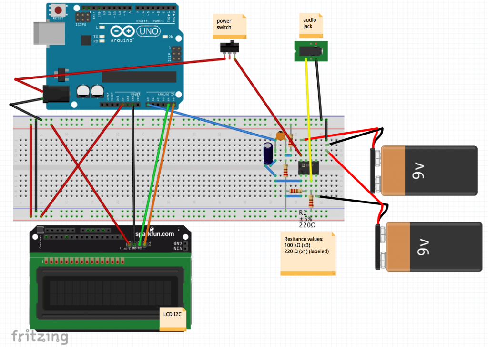

# Guitarduino-Tuner

The Guitarduino tuner does what any guitar tuner should do; tells you if your guitar is in tune or not. The guitar is plugged into the tuner through a 1/4 inch audio jack, and the tuner is turned on by a power switch on the side. The display screen then turns on, with the words “Play a note!”. Once a note is played and a frequency is detected, the display screen shows what note is being played and whether it is flat (b), sharp (#), or in tune. 

# How does it work?

